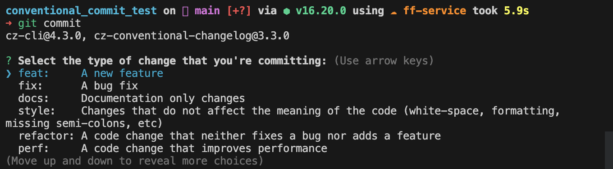

# Conventional Commit

## Step

1. commitizen을 설치해준다.

- commitizen은 커밋의 포맷을 설정해주는데에 도움을 주는 모듈이다.

```bash
yarn add -D commitizen
```

2. commitizen을 프로젝트에 세팅해준다.

```bash
## yarn을 사용시에 
npx commitizen init cz-conventional-changelog --yarn --dev --exact 
## 혹은 1번에서 전역 설치를 진행 후에 
commitizen init cz-conventional-changelog --yarn --dev --exact
```

3. husky, commitlint, lint-staged를 설치해준다.

```bash
yarn add -D husky @commitlint/config-conventional @commitlint/cli
```

4. commitlint.config.js 파일에 @commitlint/config-conventional 관련 설정을 추가한다.

```bash
echo "module.exports = {extends: ['@commitlint/config-conventional']}" > commitlint.config.js
```

5. 프로젝트에 husky 설치

- husky란?
  - nodejs 환경에서 git hook을 조금 더 원활하게 사용이 가능하게끔 하는 라이브러리

```bash
npx husky install
```
</img>

6. prepare-commit-msg에 commitizen 설정을 해준다
-  커밋 메시지를 작성시에 포맷에 맞게 작성이 되게끔 도움을 준다. 
```bash
npx husky add .husky/prepare-commit-msg 'exec < /dev/tty && git cz --hook || true'
```

7. 